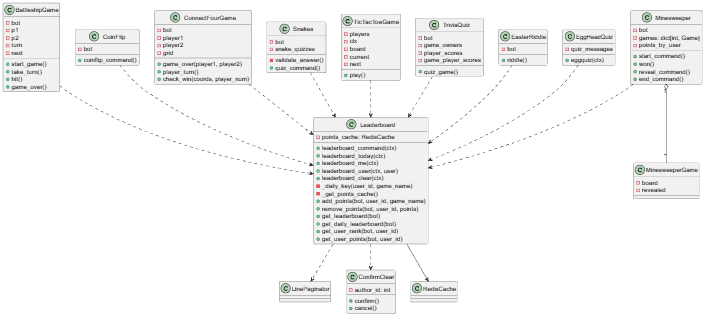

# Report for assignment 4

## Project

Name: Sir Lancebot

URL: https://github.com/python-discord/sir-lancebot

TODO: One or two sentences describing the project

## Overview of issue(s) and work done

Title: Global Leaderboard

URL: https://github.com/python-discord/sir-lancebot/issues/627

      TODO: Summary in one or two sentences      

      TODO: Scope (functionality and code affected).      

## Onboarding experience

Did you choose a new project or continue on the previous one?

If you changed the project, how did your experience differ from before?

## Effort spent

For each team member, how much time was spent in

- **Ammar Alzeno:**
    1. plenary discussions/meetings;
    2. discussions within parts of the group;
    3. reading documentation;
    4. configuration and setup;
    5. analyzing code/output;
    6. writing documentation;
    7. writing code;
    8. running code?

- **Jens Cancio:**
    1. plenary discussions/meetings;
    2. discussions within parts of the group;
    3. reading documentation;
    4. configuration and setup;
    5. analyzing code/output;
    6. writing documentation;
    7. writing code;
    8. running code?

- **Amanda Henrion Eskeus:**
    1. plenary discussions/meetings: 2.5 hrs
    2. discussions within parts of the group: 5 min
    3. reading documentation: ~1.5 hrs
    4. configuration and setup: 1.5 hrs
        - updating python, installing uv, gitpod, learning about setting up a discord bot, looking for and setting environment variables
    5. analyzing code/output: 0 min
    6. writing documentation (requirements + UML): 4 hrs
    7. writing code (UML): ~2.5 hrs
    8. running code: 2 min

- **Anna Remmare:**
    1. plenary discussions/meetings;
    2. discussions within parts of the group;
    3. reading documentation;
    4. configuration and setup;
    5. analyzing code/output;
    6. writing documentation;
    7. writing code;
    8. running code?

- **Nora Wennerström:**
    1. plenary discussions/meetings;
    2. discussions within parts of the group;
    3. reading documentation;
    4. configuration and setup;
    5. analyzing code/output;
    6. writing documentation;
    7. writing code;
    8. running code?

For setting up tools and libraries (step 4), enumerate all dependencies
you took care of and where you spent your time, if that time exceeds
30 minutes.

## Requirements for the new feature or requirements affected by functionality being refactored

**Overall goal**  
Combine the leader-boards from all the existing games into a global leaderboard.

**Functional requirements**  
The new feature should satisfy the following functional requirements:

- **FR1:** Players should be able to see a global leaderboard using a certain command. This leaderboard should display each player's earned points since it was initiated or since it was last cleared.
    - FR1.1: Only admins should be able to clear the global leaderboard
    - FR1.2: The global leaderboard should automatically update a player's points as soon as they finish playing a game that make use of a leaderboard. add_point and remove_points utils functions would be helpful to implement and use for this
    - FR1.3: There is a limit for how many points a player can earn per day. After said limit is reached, players can still play games but no more points are added until the daily global leaderboard is reset.

- **FR2:** Players should be able to see a daily global leaderboard using a certain command. This leaderboard should display each player's earned points from the current day.
    - FR2.1: The daily global leaderboard should reset automatically at the start of each day.
    - FR2.2: The daily global leaderboard should automatically update a player's points as soon as they finish playing a game that make use of a leaderboard. add_point and remove_points utils functions would be helpful to implement and use for this
    - FR2.3: Changes made to the daily global leaderboard should not influence players' number of points in the global leaderboard or any game-specific leaderboard, meaning the daily reset should not remove any points from other leaderboards
    - FR2.4: There is a limit for how many points a player can earn per day. After said limit is reached, players can still play games but no more points are added until the daily global leaderboard is reset.

- **FR3:** Points in the global leaderboard and daily global leaderboard are normalized points/coins from each of the following games' leader-boards:
    - FR3.1: Battleship
    - FR3.2: Connect 4
    - FR3.3: Riddle
    - FR3.4: Eggquiz
    - FR3.5: Minesweeper
    - FR3.6: Tic Tac Toe
    - FR3.7: Quiz
    - FR3.8: Snake Quiz
    - FR3.9: Snakes And Ladders

 

**Non-functional requirements**  
The new feature should satisfy the following non-functional requirements:

- **NFR1:** The displays of the global leaderboard and daily global leaderboard should be easily understandable and pretty

      TODO: Optional (point 3): trace tests to requirements.      

## Code changes

### Patch

(copy your changes or the add git command to show them)

git diff ...

Optional (point 4): the patch is clean.

Optional (point 5): considered for acceptance (passes all automated checks).

## Test results

Overall results with link to a copy or excerpt of the logs (before/after
refactoring).

## UML class diagram and its description

The UML class diagram above illustrates the main classes involved in the global leaderboard system, tracking points earned by users across different games and displaying rankings using Discord commands.

The central class is Leaderboard, which is implemented as a Discord Cog. It handles all leaderboard-related commands such as displaying rankings, showing user scores, and clearing the leaderboard using helper methods. The leaderboard data is stored using RedisCache, which provides persistent storage for the user points. 

The ConfirmClear class is a discord.ui.View used to display interactive buttons that allow administrators to confirm or cancel clearing the leaderboard.

Pagination of leaderboard results is handled by the LinePaginator utility class, which splits large result sets into multiple Discord messages.

Game classes contribute points to the leaderboard when a game ends. These classes interact indirectly with the leaderboard system through leaderboard utility functions. In order to avoid confusion, several game classes that whad the same name have been renamed in the UML diagram to match the game they are representing. This change regards BattleshipGame, ConnectFourGame, MinesweeperGame, and TicTacToeGame. 

### Key changes/classes affected

The only new classes are Leaderboard and ConfirmClear. All the game classes were otherwise present at the start of the project. They have been affected in the sense that they were refactored to also record points for the global leaderboard at the end of a game session. RedisCache and LinePaginator have not been affected other than for the fact they are now used by Leaderboard.

**Optional (point 1): Architectural overview.**

The leaderboard system follows a modular architecture, where functionality is separated into different components:
- Cogs for handling command logic
- Utility modules for management and calculations
- Cache systems for data to be persisted (RedisCache in this case)
- Game modules for awarding points

This separation seems to be quite typical for Discord bots. It improves maintainability and allows new games to easily integrate with the global leaderboard system without modifying existing leaderboard logic.

**Optional (point 2): relation to design pattern(s).**

The leaderboard system makes more or less use of some common software design patterns.

The Command Pattern is used through the Discord command framework, where user commands trigger specific methods within the Leaderboard cog.

The Model–View–Controller (MVC) design pattern is loosely followed. For the global leaderboard, the data (which corresponds to the model) is stored using RedisCache, and the command logic is grouped in the Leaderboard class. As for the view, Discord messages are paginated using LinePaginator before being displayed to users with embeds. For the different games, the separation of the three parts varies, most likely depending on who made the contribution.

## Overall experience

What are your main take-aways from this project? What did you learn?

How did you grow as a team, using the Essence standard to evaluate yourself?

Optional (point 6): How would you put your work in context with best software engineering practice?

Optional (point 7): Is there something special you want to mention here?
